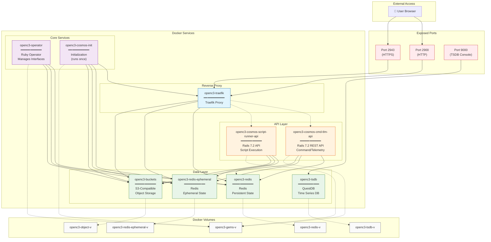

# OpenC3 COSMOS Architecture

This document describes the architecture of OpenC3 COSMOS, a command and control system for embedded systems.

## System Overview

OpenC3 COSMOS is deployed as a set of Docker containers that work together to provide a web-based interface for telemetry display, command sending, script execution, logging, and more.

## Architecture Diagram



## Service Descriptions

### Proxy Layer

| Service | Description |
|---------|-------------|
| **openc3-traefik** | Traefik reverse proxy that handles all incoming HTTP/HTTPS traffic on ports 2900 and 2943. Routes requests to appropriate backend services. |

### API Layer

| Service | Description |
|---------|-------------|
| **openc3-cosmos-cmd-tlm-api** | Rails 7.2 REST API for command and telemetry operations. Handles WebSocket connections via AnyCable for real-time updates. |
| **openc3-cosmos-script-runner-api** | Rails 7.2 API for script execution. Manages running Ruby and Python scripts for automation. |

### Core Services

| Service | Description |
|---------|-------------|
| **openc3-operator** | Ruby-based operator that manages interfaces and microservices. Spawns and monitors target interfaces, routers, and other dynamic components. |
| **openc3-cosmos-init** | Initialization container that runs once on startup. Loads plugins, tools, and initial configuration into the system. |

### Data Layer

| Service | Description |
|---------|-------------|
| **openc3-redis** | Redis instance for persistent state storage. Stores configuration, command/telemetry definitions, and system state. |
| **openc3-redis-ephemeral** | Redis instance for ephemeral data. Handles pub/sub messaging and temporary state that doesn't need persistence. |
| **openc3-buckets** | S3-compatible object storage (Versitygw). Stores logs, configuration files, and plugin artifacts. |
| **openc3-tsdb** | QuestDB time series database. Stores historical telemetry data for analysis and graphing. |

## Docker Volumes

| Volume | Purpose |
|--------|---------|
| **openc3-redis-v** | Persistent Redis data |
| **openc3-redis-ephemeral-v** | Ephemeral Redis data |
| **openc3-object-v** | S3 bucket object storage |
| **openc3-gems-v** | Shared Ruby gems and Python packages |
| **openc3-tsdb-v** | QuestDB time series data |

## Network Ports

| Port | Protocol | Service | Description |
|------|----------|---------|-------------|
| 2900 | HTTP | openc3-traefik | Main web interface |
| 2943 | HTTPS | openc3-traefik | Secure web interface |
| 9000 | HTTP | openc3-tsdb | QuestDB console and ingest |

## Service Dependencies

```
openc3-cosmos-init
├── openc3-traefik
│   ├── openc3-redis
│   ├── openc3-redis-ephemeral
│   └── openc3-buckets
├── openc3-redis
├── openc3-redis-ephemeral
└── openc3-buckets

openc3-cosmos-cmd-tlm-api
├── openc3-redis
├── openc3-redis-ephemeral
└── openc3-buckets

openc3-cosmos-script-runner-api
├── openc3-redis
├── openc3-redis-ephemeral
└── openc3-buckets

openc3-operator
├── openc3-redis
├── openc3-redis-ephemeral
└── openc3-buckets
```

## Communication Patterns

1. **HTTP/REST**: External clients communicate with the system via Traefik on port 2900/2943
2. **WebSocket**: Real-time updates use AnyCable backed by Redis pub/sub
3. **Redis Pub/Sub**: Internal service-to-service messaging for events and state changes
4. **S3 Protocol**: Log and configuration file storage via the buckets service

## Startup Sequence

1. **Data layer starts first**: Redis, Redis Ephemeral, Buckets, and TSDB containers start
2. **Proxy starts**: Traefik starts and waits for data layer
3. **Init runs**: openc3-cosmos-init loads plugins and initial configuration
4. **APIs start**: cmd-tlm-api and script-runner-api become available
5. **Operator starts**: Spawns configured interfaces and microservices

## Technology Stack

- **Ruby 3.4** - Backend APIs and core library
- **Rails 7.2** - REST APIs with AnyCable for WebSockets
- **Python 3.10-3.12** - Alternative scripting language
- **Vue.js 3 + Vuetify 3** - Frontend UI framework
- **Redis** - Caching, pub/sub, state management
- **QuestDB** - Time series database
- **Versitygw** - S3-compatible object storage
- **Traefik** - Reverse proxy and load balancer
- **Docker Compose** - Container orchestration
